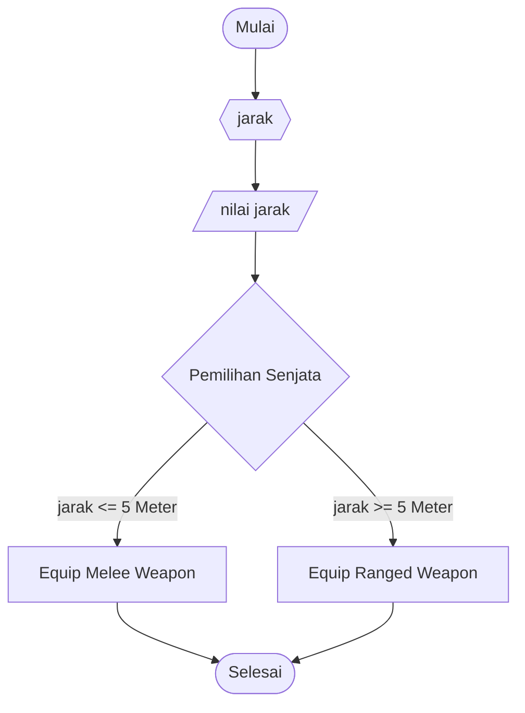

# Latihan Individu 1 #

```mermaid
flowchart TD;
    A([Mulai]) --> B{{jarak}}
    B --> C[/nilai jarak/]
    C --> D{Pemilihan Senjata}
    D -->|jarak <= 5 Meter| E[Equip Melee Weapon]
    D -->|jarak >= 5 Meter| F[Equip Ranged Weapon]
    E --> G([Selesai])
    F --> G
```